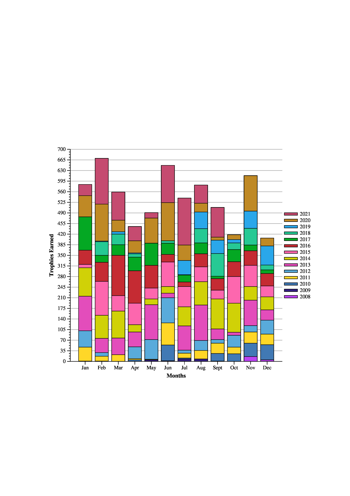

# ps_trophies
Creates graphs of playstation trophy data using JGraph


## Some background
The main program is bin/graph_trophies

I have included a csv file of my trophy data so it can be run. Originally I was trying to pull my trophy data from Sony's website. However, their API is not public.
So I tried to follow this github repository and several others. https://andshrew.github.io/PlayStation-Trophies/#/
As it turns out none of the public methods work anymore. Likely because Sony has now implemnted two factor authentication and doesn't want to get hacked again. After trying for serveal weeks to pull the json from Sony I decided to download it from https://www.truetrophies.com/. I had to pay for the service but they allow you to download your own trophy data in a csv file. 

I tried to write the program so that it can work with others peoples trophy data but without knowing how Sony handles their API and authentication calls it is kinda limited to using this middle of the road step. 

I have removed the titles of the columns in the csv file and the entire column of links to their website. 

## Set Up
1. Clone repository
2. Make sure ps2pdf and convert are installed

## Usage

```
./bin/graph_trophies [input.csv] [output.jgr] [graph choice]
```

### graph_choice arguments
* `bar_graph_months`
* `line_graph_months`
* `bar_graph_time`

### Example
bar_graph_months


## Output
The program will run the command
```
./jgraph/jgraph -P [output.jgr] | ps2pdf - | convert -density 300 - -quality 100 [output.jpg]
```
Once it is finished the directory will have both a [output.jgr] file and a [output.jpg]. 
The [output.jpg] file will be the image of the graph. 
